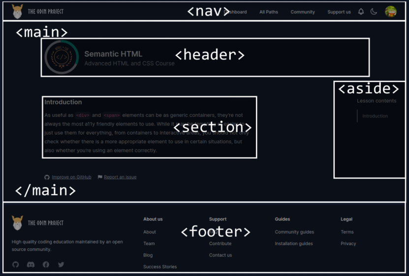

# Semantic HTML
- While `div` and `span` may be the most common, they are not a11y friendly
- In terms of web accessibility, using semantic HTML is important because it provides meaning and context. 
- Some elements have a semantic meaning, but don’t really provide any context when announced by assistive technologies, such as the `<p>` element. Then there are elements that have a semantic meaning and are announced with some sort of context to help users perceive or operate them, like a `<button>`.
- Let's take a look at an example:
```
<!-- These are buttons... right? -->
<div class="button-container">
  <div class="rock">Rock</div>
  <div class="paper">Paper</div>
  <div class="scissors">Scissors</div>
</div>
```
- Now in above code, a person with normal sightness can easily know which are rock or not, but a person with visual disabiltiy cannot distinguish that is it a text or what? because the screen reader would announce the text contents of the element (“Rock”, “Paper”, or “Scissors”), and the user might think it’s just plain text on the page and move on. There’s no context to tell the user that they’re supposed to, or that they even can, interact with these elements.
- So Look at code below
```
<!-- Okay, these are *definitely* buttons -->
<div class="button-container">
  <button class="rock">Rock</button>
  <button class="paper">Paper</button>
  <button class="scissors">Scissors</button>
</div>
```
- This issue can be easily fixed by using semantic HTML
- Because the `<button>` element has a semantic meaning and provides context, a screen reader would announce the text content as well as the role of the element: “Rock, button”.
- When you use a input element, you should always establish a relationship between input and label
- A `<label>` provides context for what an input actually means to assistive technologies, announcing the label contents each time the input is announced. 
- Not only that, but a proper <label> increases the clickable area of the input itself, which is useful for users who have trouble clicking on smaller items.
```
<label for="name">Name</label>
<input type="text" id="name">
```

## Landmarks
-  Landmarks are HTML elements that act as regions of a page. There are seven native HTML elements that define these landmark regions:
1) `<aside>`
2) `<footer>`
3) `<form>`
4) `<header>`
5) `<main>`
6) `<nav>`
7) `<section>`

