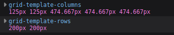

- To revisit grid, refer to [Grid](./Grid.md)
## Advanced Grid Properties

### repeat()
- is a function that acts as a shorthand for defining multiple tracks of same size.
- eg: `grid-template-column: 150px 150px 150px 150px 150px ` can be written as `grid-template-column: repeat(5,150px)`.

### Fractional unit
- They are used to make Grids "dynamic".
- The most common unit is `fr`.
- The `fr` unit is the way of distributing whatever remaining space is left(excluding gap unlike %).
- when using `fr`, all the grid-items fill the whole space unlike static.
- They make Grids dynamic by allowing tracks to expand or shrink.
- TIP: we can also mix units like `px` with `fr`.

### Minimum and maximum track sizes: min() and max()
- `min()`:- selects the smallest value from list. Acts as a maximum ceiling(cap)
- Syntax Example:
    width: `min(50%, 200px);`
    How the Browser Decides:

    - The Goal: The element wants to be 50% of its parent container.

    - The "Check": As the container grows, that 50% value increases (e.g., 100px, 150px, 190px).

    - The "Cap": Once 50% becomes larger than 200px (for example, if the container is 500px wide, 50% is 250px), the browser sees min(250px, 200px).

    - The Result: It picks 200px. The element "stops" growing even if there is more space available.

- `max()`:- selects the largest value from list. Acts as a minimum limit(Safety net)
- Syntax Example:
    width: max(15%, 120px);
    How the Browser Decides:

    - The Goal: The element wants to be 15% of its parent container.

    - The "Check": As the container shrinks, that 15% value decreases (e.g., 200px, 150px, 130px).

    - The "Floor": Once 15% becomes smaller than 120px (for example, if the container is 400px wide, 15% is only 60px), the browser sees max(60px, 120px).

    - The Result: It picks 120px. The element "stops" shrinking even if the container continues to get smaller.

-
- 
- Here, the blue background is the total parent size, but the row(grid-items) is not expanding beyond the 200px limit despite the parent streching 
- and the same can be said for max().

### Dynamic minimum and maximum sizes

#### minmax()
- It can be only be used in Grids.
- It can only be used with following CSS properties
  - `grid-template-columns`
  - `grid-template-rows`
  - `grid-auto-columns`
  - `grid-auto-rows`
- It takes only 2 arguments:- the max size grid track can be and the max size grid track can be.
- With our grid-template-columns set with minmax() values, each grid item’s width will grow and shrink with the grid container as it resizes horizontally. 
- However, as the grid shrinks, the column tracks will stop shrinking at 150px, and as the grid grows, they will stop growing at 200px. 
- i.e; for example `grid-template-rows: repeat(2, minmax(50px, 200px));`, in this it will stop "adjusting" beyond 50px and beyond max size 200px.

#### Auto-fit
- It's a part of `repeat()`.
- You should always use this with `minmax()`.
- It tells the browser to create as many columns to fill the container, without me having to define it.
- `grid-template-columns: repeat(auto-fit, minmax(200px, 1fr));`
- How the browser interprets this:
    - "Look at the width:" "How much space do I have in this .grid-container?"

    - "Do the math:" "How many 200px blocks can I fit in one row?"

    - "Create the grid:" If the container is 1000px wide, it creates 5 columns. If you shrink the window to 500px, it automatically drops to 2 columns. Because 200px*2=400px<500px.

    - "Stretch to fill:" Because of the 1fr, it stretches those columns to fill any tiny gaps left over.

#### Auto-fill
- It's a part of `repeat()`.
- You should always use this with `minmax()`.
- It tells the browser to fill as much space as necessary and then fill the remaining space with ghost grid items.
- `grid-template-columns: repeat(auto-fill, minmax(200px, 1fr));`
- How the browser interprets this:

    - "Look at the width:" "How much space do I have in this .grid-container?"

    - "Do the math:" "How many 200px blocks can I fit in one row?"

    - "Create the grid (The Ghost Slots):" If the container is 1000px wide, it insists on creating 5 columns, even if you only have 2 items. It treats the empty space as "Ghost Columns."

    - "Preserve the slots:" Unlike auto-fit, it will not collapse the empty columns.

    - "Distribute the stretch:" Because of the 1fr, the browser divides the 1000px by all 5 slots.

    - The Result: Each of your 2 items stays exactly 200px wide. You see your 2 items on the left, followed by 600px of empty, structured grid space on the right.

#### Difference between Auto-fill and Auto-fit
- let's say the width of grid container is 500px and grid items width is 100px each and there are only 3 grid-items.
- then `auto-fit` will stretch both grid-items to fill the remaining space. so for eg. auto-fit will let grid-items occupy the whole 500px space instead of just 300px for 100px each. like this
-  
- but `auto-fill` will not stretch grid-items, for eg, auto-fill will let grid-items occupy only 300px for 100px each, so the remaining 200px will be filled by empy grid-items. like this
- 

- But here's the catch, for a fixed units like `px` it will work like above, but for flexible units like `fr`, here how auto-fit and auto-fill work.
- auto-fit (The "Accordion")

    - Calculate: "I can fit five 100px slots."

    - Check Content: "I only have 3 items."

    - Collapse: It deletes the 2 empty slots (5−2=3 columns).

    - Stretch: It divides the whole 500px by those 3 columns.

    - Final Result: Each of your 3 items becomes 166.6px wide to fill the whole 500px.

- auto-fill (The "Parking Lot")

    - Calculate: "I can fit five 100px slots."

    - Check Content: "I only have 3 items."

    - Preserve: It keeps all 5 slots (3 full+2 empty).

    - Stretch: It divides the 500px by all 5 slots.

    - Final Result: Each item stays 100px wide. You see your 3 items, followed by 200px of "ghost" slots.
