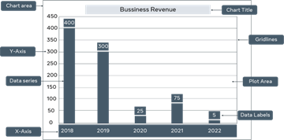
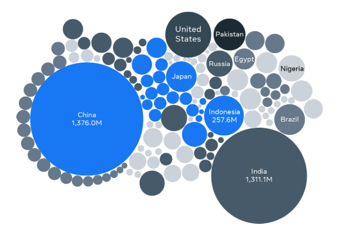

# What is a database
- A database is a form of electronic storage where data is stored and organised systematically.
- eg: a bank, hospital etc. use database.
- Database look typically like a spreadsheet or a table.
- All data can be identified using attributes/features and this data is seperated and stored in entities.
- These entity could be physical like an employee or conceptual like invoice, orders etc.
  
# How are data related
- Data across different tables can be linked using primary keys and foreign keys.
- Primary keys is ,non-empty/null, unique key that is unique to a paritcular row/record. It can used to unique identify a record.
- When a primary key is used in another table to link the row, it is known as Foreign key.
- eg: customer-> cust_id, order->ord_id, order_sheet->cust_id, ord_id.
- Here in above example both primary keys of order and customer table are used in order_sheet which helps to track the order details of a particular customer.

# Types of Relational Database

## Bar chart
- A bar chart is a graph that presents categorical data with rectangular bars, where the heights of the bars are proportional to the values that they represent. 
- 

## Bubble Chart
- It shows how different values compare to each other in terms of bubble size. The smaller bubbles represent smaller values, and the larger bubbles represent larger values. 
- 

## Line chart
- A line chart presents information as a series of data points called “markers” connected by straight line segments. Line charts are extremely popular and are widely used in most data analytics fields.