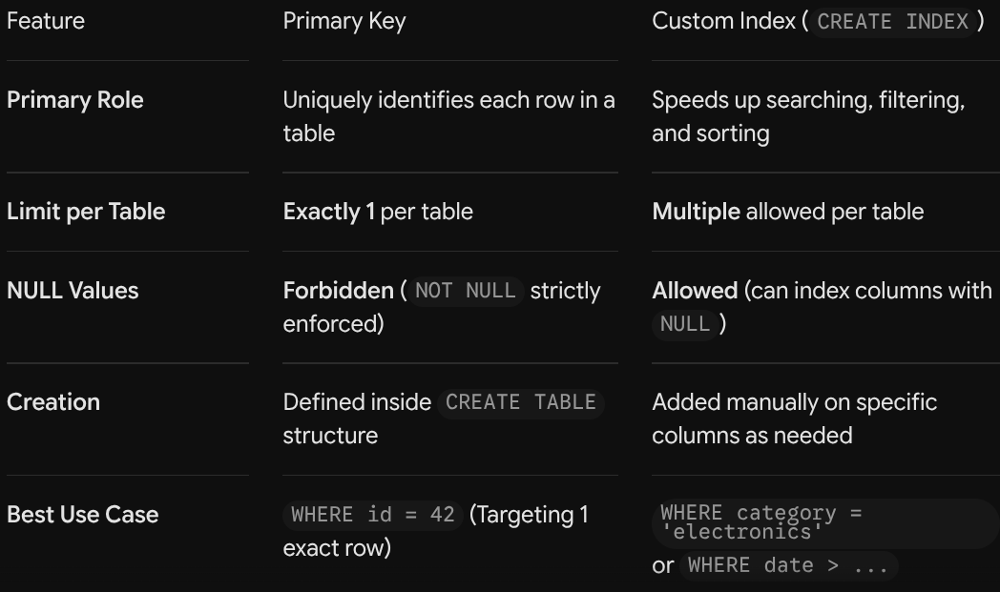

# Introduction
- SQL (Structured Query Language) is the universal programming language used to talk to databases like PostgreSQL, MySQL, and SQLite.

# Clause
- A clause in SQL is a built-in keyword or built-in statement component used to filter, sort, group, compute, or manipulate data in database queries.

## 1) Data Manipulation Clause
  - Used for reading, filtering, grouping, and ordering data.
    - 1) `from`
      - Specifies the target table to pull data from.
      - `SELECT * FROM users;`
    - 2) `WHERE`
      -  Filters individual rows before any grouping or aggregation takes place.
      -  `SELECT * FROM users WHERE status = 'active';`
     - 3) `GROUP BY`
       -  Groups rows sharing identical column values into summary rows.
       -  `SELECT role, COUNT(*) FROM users GROUP BY role;`
      - 4) `having`
        - Filters aggregated groups generated after a GROUP BY clause.
        - `SELECT role, COUNT(*) FROM users GROUP BY role HAVING COUNT(*) > 5;`
      - 5) `order by`
        - Sorts query in ascending or descending order
        - `SELECT * FROM users ORDER BY created_at DESC;`
      - 6) `Limit/Offset`
        - Restricts the total number of returned rows and skips a specified number of initial rows.
        - `SELECT * FROM users LIMIT 10 OFFSET 20;`
        - This query retrieves 10 rows from the users table, starting at row 21 (skipping the first 20 rows).

## 2) Table Joining Clauses
- Used to combine records across two or more tables based on related columns.
 - 1) `join/on`
   - Combines rows from two tables where a specified matching condition is met.
   - `SELECT * FROM orders JOIN users ON orders.user_id = users.id;`
## 3) Data Modification Clauses
- Used alongside INSERT, UPDATE, and DELETE operations.
  - 1) `set`
    - Assigns new values to specific columns during an update operation.
    - `UPDATE users SET status = 'inactive' WHERE id = 1;`
  - 2) `VALUES`
    - Provides the raw data values to be inserted into a table.
    - `INSERT INTO users (name, email) VALUES ('Alice', 'alice@gmail.com');`
# Queries
- A query is a written command sent to a database to retrieve, insert, update, modify, or delete stored data.
## 1) Data Query Language(DQL)
  - 1) `select`
    - Retrieves data rows from one or more tables based on specific criteria
    - `SELECT name, email FROM users WHERE status = 'active';`
## 2) Data Manipulation Language(DML)
  - 1) `INSERT`
    - Adds new rows of data into a specified table.
    - `INSERT INTO users (name, email) VALUES ('Alice', 'alice@gmail.com');`
  - 2) `UPDATE`
    - Modifies existing records in a table based on a matching condition.
    - `UPDATE users SET status = 'inactive' WHERE id = 1;`
  - 3) `DELETE` 
    - Removes specific rows of data from a table without destroying the table structure.
    - `DELETE FROM users WHERE status = 'banned';`
## 3) Data Definition Language(DDL)
  - 1) `CREATE TABLE`
    - Defines a new table structure with specified column names, data types, and constraints.
    - `CREATE TABLE users (id SERIAL PRIMARY KEY, name TEXT NOT NULL);`
  - 2) `ALTER TABLE`
    - Modifies the structure of an existing table, such as adding or removing columns.
    - `ALTER TABLE users ADD COLUMN age INT;`
  - 3) `DROP TABLE`
    - Permanently deletes an entire table along with all of its contained data.
    - ` DROP TABLE users;`
  - 4) `TRUNCATE`
    - Rapidly deletes all records from a table while keeping its structure intact.
    - `TRUNCATE TABLE users;`
## 4) Advanced Query Operations (Joins & Aggregates)
- Used to combine multiple tables or perform mathematical calculations across rows.
  - 1) `INNER JOIN`
    - Combines rows from two tables where there is a matching value in both tables.
    - `SELECT users.name, orders.total FROM users INNER JOIN orders ON users.id = orders.user_id;`
  - 2) `LEFT JOIN`
    - Summary: Returns all records from the left table and matched records from the right table. 
    - `SELECT users.name, orders.total FROM users LEFT JOIN orders ON users.id = orders.user_id;`
  - 3) `GROUP BY & Aggregates`
    - Groups rows sharing the same values to calculate aggregated totals, averages, or counts.
    - `SELECT status, COUNT(*) FROM users GROUP BY status;`

# Create Index
- `CREATE INDEX` is an SQL command used to build a dedicated, high-speed lookup structure on one or more columns of a database table.
- Its sole purpose is to make searching, filtering (WHERE), joining (JOIN), and sorting (ORDER BY) significantly faster without changing the actual data inside the table.
- Syntax
```
CREATE UNIQUE INDEX index_name 
ON table_name (column_name);
```
- Difference between primary key and create table
- 

# Why SQL is faster than your code
- 1) Zero Network Waste: 
  - SQL filters data directly inside the database and sends you back only the 10 rows you need, instead of downloading 1,000,000 rows over the network into your app's memory.
- 2) B-Tree Indexes: 
  - Finding a user in a JS array forces a loop through every item ($O(N)$). Postgres uses indexes to jump straight to the row in 3–4 steps ($O(\log N)$).
- 3) C Performance: 
  - Postgres is written in compiled C operating directly on raw memory/disk, while Node.js runs high-level JavaScript with runtime overhead and garbage collection.