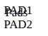
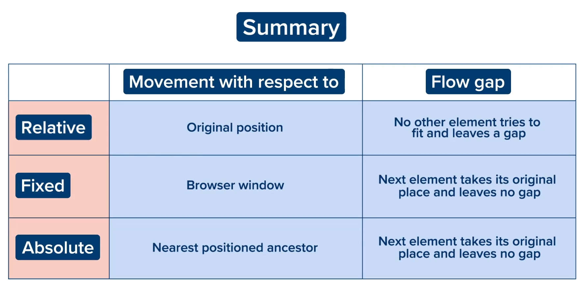

# Position
- Helps us to move HTML elements from their existing positions.

## Position Properties
- top
- left
- right
- bottom
- we can enter `px` in them.
  
## Position:static
- `position:static`
- Default value is different for different elements.
- Elements cannot be moved from their positions.

## Position:relative
- `position:relative`.
- Helps to move an element with respect to it's original position.
- if we apply left: -20px, the element will be pulled by 20px from left w.r.t. to it's original position.

## Position:fixed
- `position:fixed`
- Moves element w.r.t. browser window.
- other elements behaves as if the element doesn't even exists.
- 
- Position of element remains fixed even if we scroll down/up
- useful for persistent nav. bars.

## Position: absolute
- `position:absolute`
- Same as fixed, other elements behave that such a element doesn't exist and is removed from workflow.
- An absolute element determines it's position based on parent that has CSS position other than static(eg. fixed, absolute, relative).
- When you use directional properties like top, bottom, left, or right, the child element treats the edges of that positioned parent as its walls. For example, if a parent is 300px wide and the child has right: 30px, the child anchors itself exactly 30px inside the parent's right edge.
- It Defaults to the Browser Window if No Parent is Found

# Summary
- 

# Z-index
- Used to position element along Z-axis.
- used mainly when there are overlapping elements and we wanna put one element over the other.
- The higher the Z-index, the more closer it is to us.
- Works only on positioned elements