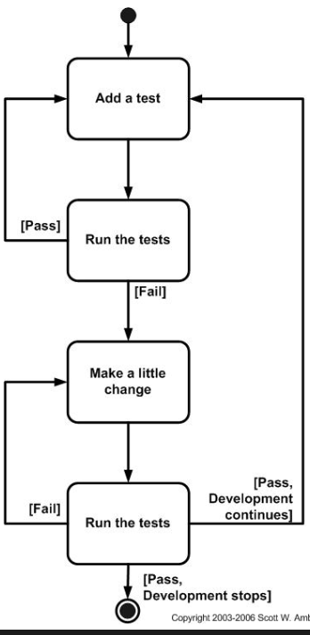

# Test Driven Development(TDD)
- Is a new evolutionary approach which emphasizes test-first development
- In this, before you write production code, you write a test for that production code first and after that you refactor the code, meaning writing test code for enough production code and then moving on.
- The primary goal of TDD is specification not validation.
- In other words, TDD is one way to think through your requirements or design before your write your functional code (implying that TDD is both an important agile requirements and agile design technique).
- The goal of TDD is to write a clean code that works.
  
# Steps
- The first step is to quickly add a test, basically just enough test for your code to fail. 
- Next you run your tests, often the complete test suite although for sake of speed you may decide to run only a subset, to ensure that the new test does in fact fail. 
- You then update your functional code to make it pass the new tests. 
- The fourth step is to run your tests again. If they fail you need to update your functional code and retest until the tests pass.

# Advantages of Automated test cases
- Keeps you out of the (time hungry) debugger!
- Reduces bugs in new features and in existing features
- Reduces the cost of change
- Improves design
- Encourages refactoring
- Builds a safety net to defend against other programmers
- Forces you to slow down and think
- Speeds up development by eliminating waste
- Reduces fear
