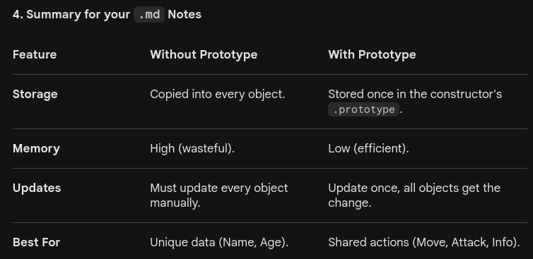

# Object constructor
- They work like class in cpp.
- Manually typing the contents of all of our objects is not feasable.
- When you have a specific type of objects which you have to make multiple of, we use constructors.
- eg:
 `function Player(name, marker) {`
  `this.name = name;`
  `this.marker = marker;`
`}`
- It creates a single template so every object have same structures
- We can scale and make many objects.
- Data is consistent.

- NOTE: since constructors can be called without `new` keyword and which would in turn give all sort of errors, we can use `new.target` meta to throw and error if an object is created without `new` keyword. Put this at very top of constructor.
- `if(!new.target){console.log("ERROR")}`

# Instantiating Objects
- Then object/s can be instantiated using these constructers.
- eg:
`const player = new Player("steve", "X");`
`console.log(player.name); // "steve"`.

# Object Prototype
- Prototype are the mechanism by which JS objects inherit features from one another.
- Every object in JS has a built-in property called Prototype.
- The prototype is itself an object, so the prototype will have its own prototype, making what's called a prototype chain. The chain ends when we reach a prototype that has null for its own prototype.
- When you try to access a property of an object: if the property can't be found in the object itself, the prototype is searched for the property. If the property still can't be found, then the prototype's prototype is searched, and so on until either the property is found, or the end of the chain is reached, in which case undefined is returned.
- 