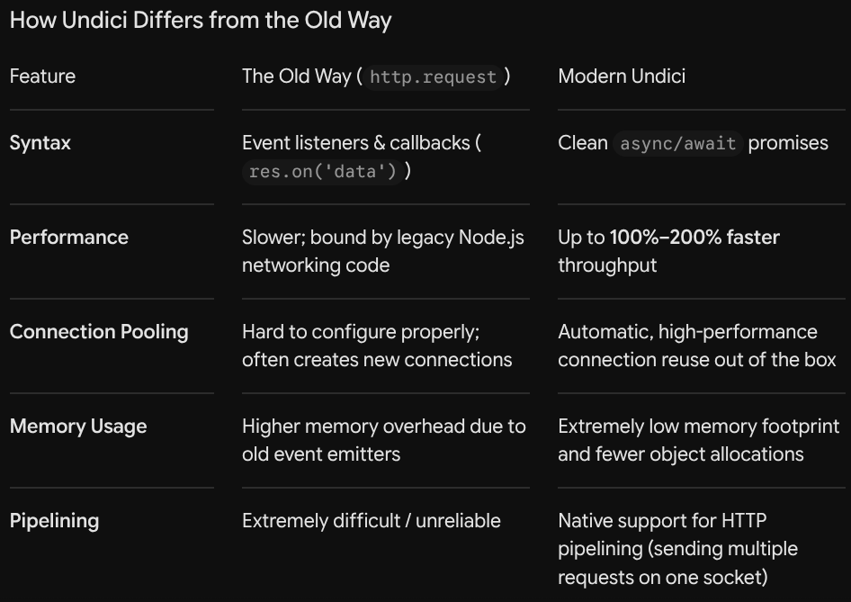

# Undici
- Undici is a low level, lightweight HTTP client library written for Node.js to handle network requests (like getting or posting data to a server) as fast as possible.
- An HTTP client library is simply a pre-made tool or code package that allows your program to talk to web servers over the internet or a local network.

## How does Undici differs from old-fashioned way
- 

# How to use Undici
- You have to import undici first.
-
```
// After: Undici fetch (drop-in replacement)
import { fetch } from 'undici';
const response = await fetch('https://api.example.com/data');

// Or: Undici request (better performance)
import { request } from 'undici';
const { statusCode, body } = await request('https://api.example.com/data');
const data = await body.json();
```

# Keep Fetch and FormData together
- When you send a FormData body, keep fetch and FormData from the same implementation.
- Now you can use `install()` which changes the global environment But if you are writing an open-source library or a package meant to be shared with other developers, modifying global variables can cause unexpected side effects in their code. In that specific case, explicit imports 
`(import { fetch } from 'undici')` are generally preferred.
-
```
import { install } from 'undici'

install()

const body = new FormData()
body.set('name', 'some')
await fetch('https://example.com', {
  method: 'POST',
  body
})
```

# Reading/Writing File
## readFile
- Executes asynchronously, meaning that the code continues to execute without waiting for the file operation to complete. It requires a callback function to handle the file content once it’s read.