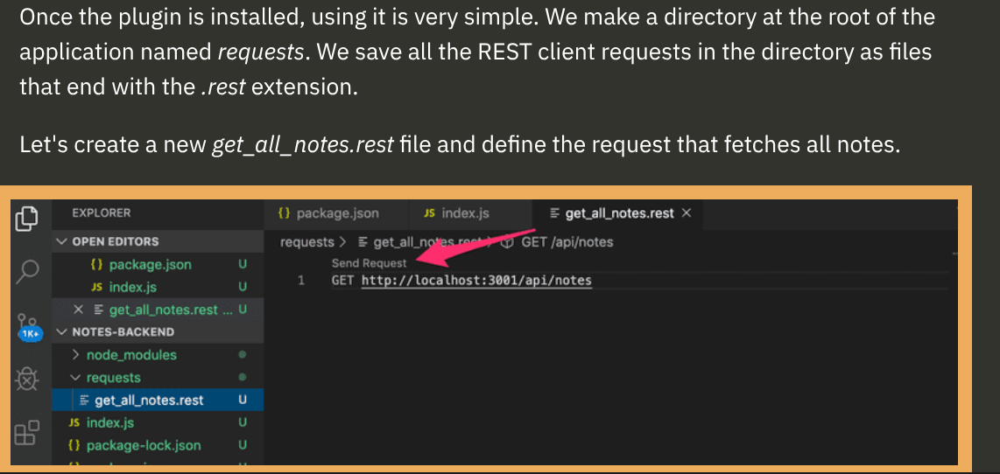
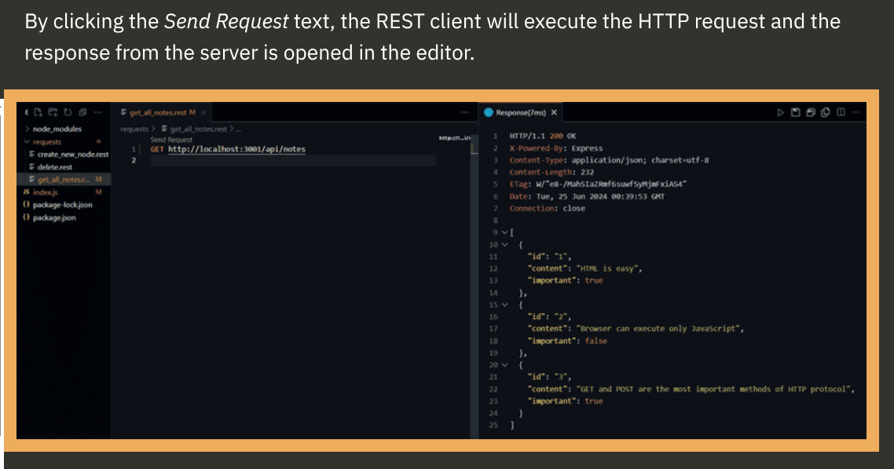

# Simple Web Server
-  
```
const http = require('http')

const app = http.createServer((request, response) => {
  response.writeHead(200, { 'Content-Type': 'text/plain' })
  response.end('Hello World')
})

const PORT = 3001
app.listen(PORT)
console.log(`Server running on port ${PORT}`)
```
- In first line, we import Node.js web-server module(http), It is simply a tool that allows an program to handle web requests.
- The code uses `createServer` of http module to create a new web server. 
  - This web server lives inside CPU, It listens on a network port, processes incoming requests (req), and returns responses (res).
  - We use Express because Raw `http.createServer()` requires a lot of manual `if/else`, Frameworks like Express are build on top of `http.createServer()` to make routing much cleaner.
- An Event handler is registered to the server that is called **Every time** and http request is made.
- Then request is responded with status code 200(success request), with `Content-Type` header set to `text/plain` and content is to returned set to `hello world`.
- The Last row binds the app variable, to listen to HTTP requests send to port 3001.

# Express
- It's possible to send http requests with node.js alone but when application grows in size, it becomes cumbersome, that's why in here Express comes
- `npm install express`
-  
```
{
  // ...
  "dependencies": {
    "express": "^5.1.0"
  }
}
```
- To use it first, we have to import express
-  
```
const express = require('express')
const app = express()
let notes=[
  {
    id:"1",
    name:"Daksh",
  }
]
app.get('/', (req, res) => {
  res.send('<h1>Hello World!</h1>')
})
app.get("/api/notes",(req,res)=>{
  res.json(notes);
})
const PORT = 3001;o
app.listen(PORT, () => {
  console.log(`Server running on port ${PORT}`)
})
```
- Now in above code, `get` indicates that the browser/client is asking to retrieve data from the web server at the / path. The site/URL doesn't reach the server on its own—the client sends an HTTP GET request to that path.
- Here request slient send requests to web-server and response means sending details depending on fulfillment of request from server.
- Here, we send a response using `.send` method,s that says `<h1>Hello World!</h1>`, this simply means here that, when the browser reaches `/` then it should display `Hello World`
- Now, if you notice carefully, express automatically sets the `Content-Type` header to whatever type of Data we will be sending.
- We used `response.json(notes)` instead of `response.send()` because `response.json()` explicitly informs Express to send formatted JSON data to the client.
- The request is responded to with the json method of the response object. Calling the method will send the notes array that was passed to it as a JSON formatted string. Express automatically sets the Content-Type header with the appropriate value of application/json.
- Add this to `package.json` file `"dev": "node --watch index.js",`
- You can run the program using the command `npm run dev`

## Fetching a single resource
-  
```
app.get('/api/notes/:id', (request, response) => {
  const id = request.params.id
  const note = notes.find(note => note.id === id)
  if (note) {
    response.json(note)
  } else {
    response.status(404).end()
  }
})
```
- `request.params.id`, so in this, It's searching for a parameter by name of id.
- `const note = notes.find(note => note.id === id)`, this lines means, there's a loop running in Notes, and then if current(note.id) matches id, then put that id into note variable, correct? and if there isn't a matching id, then puts undefined inside note variable.
- And undefined is falsy.

## Deleting Resources
-  
```
app.delete("/api/notes/:id",(res,req)=>{
  const id=req.params.id;
  notes=notes.filter(note=>note.id!=id);
  res.status(204).end();
})
```
- If you wanna test Delete, then you can use VS Code's REST client plug in. Like this
- 
- 

## Adding/Requesting Data
- Adding a data happens by sending a HTTP POST request to url and by sending all the info. new data in JSON format
- For example:
-  
```
const express = require('express')
const app = express()


app.use(express.json())

//...


app.post('/api/notes', (request, response) => {
  const note = request.body
  console.log(note)
  response.json(note)
})
```
- Now what's happening here is that, the that:
- A client sends a POST request to a server an a particular URL endpoint, and then it's inside the server, so now we have to access that raw data using Express json-parser and convert it into normal json, and then store it on the database.
- Without the json-parser, the `body` property would be undefined.

## Testing Requests
- You can install and extension of "REST Client", and then you can write multiple requests to test. Look below
-  
```
GET  http://localhost:3001/api/notes
###
POST http://localhost:3001/api/notess HTTP/1.1
Content-Type: application/json

{
    "id":"1",
    "name":"Vance1"
}
```
- In above, there are two requests, one for GET and one for POST, and we can test these seperately.
- And in above code, we are mearly testing if it can recieve the code properly or not.
- We have to write these test in a seperate `.test` file.
