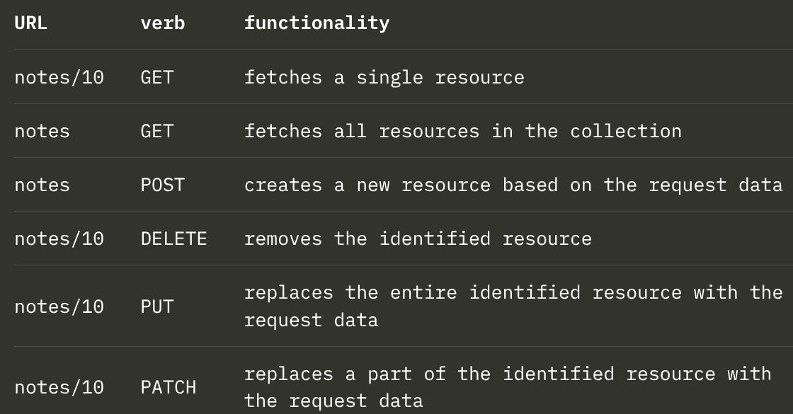

# REST
- REST stands for Representational State Transfer
- It is not a programming language, library, or software tool—it is an architectural style (a set of guidelines and rules) for designing web APIs so that different applications (like React, mobile apps, or other servers) can communicate smoothly over HTTP.
- An API that follows these rules is called RESTful.
- In simple words, applying REST means applying CRUD
  - Create(C)
  - Read(R)
  - Update(U)
  - Delete(D)

## REST Resource
- In REST, every resource have a associated URL which is the resource's unique address.
- Convention way is to combine the name of resource and resource's unique identifier.
- Let's assume root URL of our service is `www.example.com/api`
- If there is resource named as notes then we can combine it with it's identifier(10) to make `www.example.com/api/notes/10`.
- That means URL for entire collecction of notes is `www.example.com/api/notes`.
- We can execute different operations on resources. The operation to be executed is defined by the HTTP verb:
  - 