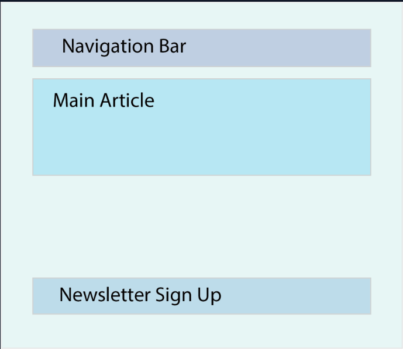

# What are Components
- The beauty of React is that it allows you to break a UI (User Interface) down into independent reusable chunks, which we will refer to as components.
- Components helps us write reusable, modular and better organised code.
- The following picture should give you an idea of how to do that when building a very basic app.

- For example, this website could be broken into the following components:
    - App, which represents your main application and will be the parent of all other components.
    - Navbar, which will be the navigation bar.
    - MainArticle, which will be the component that renders your main content.
    - NewsletterForm, which is a form that lets a user input their email to receive the weekly newsletter. 
- Think of these reusable chunks as JavaScript functions which can take some kind of input and return a React element.
- React application is a tree of components with the App(App.jsx) being the root, bringing everything together
## How to create components
- For example, create a seperate file `Greeting.jsx` inside `src` folder
```
function Greeting() { 
  return <h1>"I swear by my pretty floral bonnet, I will end you."</h1>;
}
export default Greeting
```
- Make sure to return it.
- NOTE: React components must be capitalized or they will not function as expected
- Next import it in the `App.jsx`, like this
```
import Greeting from './Greeting.jsx'
function App(){
  return <div><Greeting/ ></div>
}
export default App;
```
- Leave the `main.jsx`
- `App.jsx` is the entry point for react, like `index.html` is entry point for normal web dev
- JSX=HTML+JS
- NOTE: `rafce` is the shortcut to create a boilerplate component