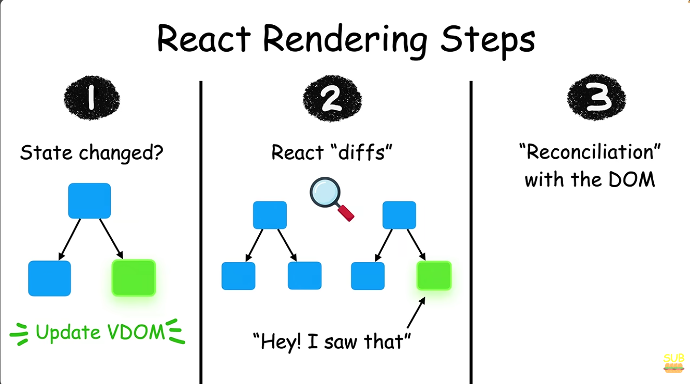

# What is Rendering
- In React, rendering techniques (or "rendering patterns") refer to how, when, and where your React code gets turned into actual HTML that the browser can display to the user.

# Rendering a list of elements in JSX
- Lets see, it through an example
- Let's say we wanna create a component that lists various animals, we will do this
```
function App() {
  return (
    <div>
      <h1>Animals: </h1>
      <ul>
        <li>Lion</li>
        <li>Cow</li>
        <li>Snake</li>
        <li>Lizard</li>
      </ul>
    </div>
  );
}
```
- But, the problem is that, we have "hard-coded" the list, so if user wants to delete something, he can't, so that's where we will use rendering
- Look at the solution below
```
function App() {
  const anims=["Lions","Cat","Dog"];
  return (
    <div>
      <ul>
        {
          anims.map((i)=>{
            return <li key={i}>{i}</li>
          })
        }
      </ul>
    </div>
  );
}
export default App;
```
- Now we have divided into 2 parts
- **1. The .map() iteration (i)**
  - "i" represents the individual element currently being processed in the anims array.
  - When React loops through anims.map((i) => ...):
    - On Round 1, i is the string "Lions".
So `<li key={i}>{i}</li>` becomes:
`<li key="Lions">Lions</li>`
    - On Round 2, i is the string "Cat".
So `<li key={i}>{i}</li>` becomes:
`<li key="Cat">Cat</li>`
    - On Round 3, i is the string "Dog".
So `<li key={i}>{i}</li>` becomes:
`<li key="Dog">Dog</li>`
  - Because`key={i}` uses the string itself, React receives `<li key="Lions">Lions</li>, <li key="Cat">Cat</li>`, etc.

 - **2. The purpose of key**
   - If you delete "Cat" from anims:
   - **Without keys**: 
     - React might get confused, wipe out the last `<li>` ("Dog"), and update the text of the second `<li>` from "Cat" to "Dog". This causes weird visual bugs, broken inputs, or unnecessary re-renders.
   - **With keys (key="Cat")**: 
     - React sees that the item with key "Cat" is missing. It precisely removes only the "Cat" DOM node from the page and leaves "Lions" and "Dog" completely untouched.
   - It keeps the rendering fast, efficient, and bug-free!
 - In short, i is the individual value that is being fetched from anims array using map, and then we are assigning a unique ID using key, to it, and the use of key is that, if somehow something got deleted, we have a way to render it properly without breaking the code

# Rendering a list of components
```
// 6. ListItem receives ONE animal string inside props (e.g. { animal: "Lion" })
//    and turns it into a <li> tag.
function ListItem(props) {
  return <li>{props.animal}</li>;
}

// 3. Here, props is an object containing the key 'animals' (props.animals = whole array)
function List(props) {
  return (
    <ul>
      {/* 4. We map over the array. 'animal' is the variable holding the single item for each loop iteration */}
      {props.animals.map((animal) => {
        // 5. A single element is sent to ListItem with prop name 'animal' and value 'animal' ("Lion", "Cow", etc.)
        return <ListItem key={animal} animal={animal} />;
      })}
    </ul>
  );
}

function App() {
  // 1. Array 'animals' is created
  const animals = ["Lion", "Cow", "Snake", "Lizard"];

  return (
    <div>
      <h1>Animals: </h1>
      {/* 2. The List component is called, passing the whole 'animals' array under the prop name 'animals' */}
      <List animals={animals} />
    </div>
  );
}

export default App;
```
- Here are steps
- 1) We create an array here called `animals`
- 2) Then we create an object (also called animals) that contains the array `animals`, and pass it into a component called `List` it's like below
```
const animals={
  ["Lions","Cows","Snake","Lizard"]
}
```
- 3) Now the `List` component will take the object animal and rename it to `props`, NOTE: props here is still an object containing the array
- 4) Now the It will traverse through the array using `map` function and pass the individual data to `ListItem` component.
- 5) Now the `ListItem` will recieve a single element(or string) and turns it into a list item using `<li>` tag.

# How does React Renders?
- It does this in 3 steps
- 
- Step 1)
  - If the state of our React app changes, React updates the Virtual DOM(VDOM), which is quicker to update than real DOM
- Step 2)
  - Then React uses a proccess called "diffing", to compare the update VDOM to previous DOM
- Step 3)
  - Once it sees that changes, React uses a process called "Reconciliation" with DOM to update the real DOM with the changes Made