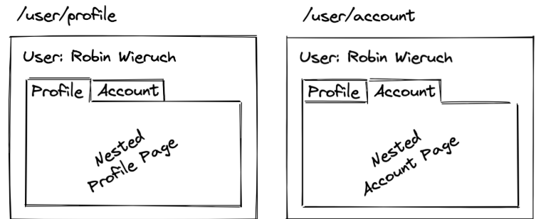
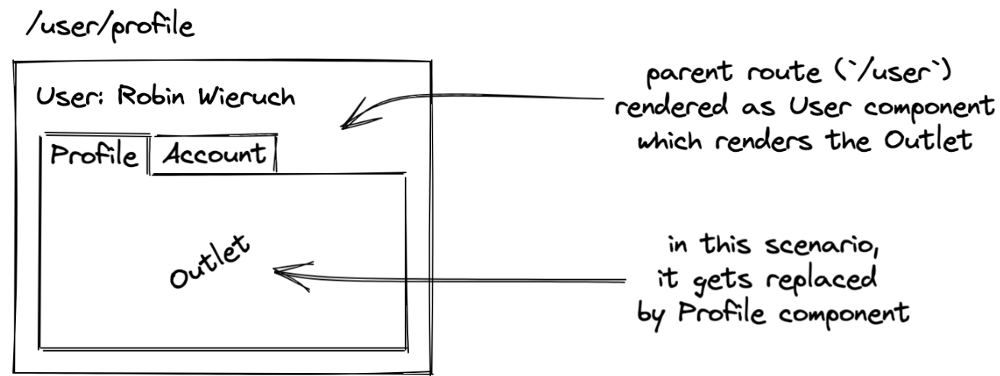

# React Router

## Single Page Application(SPA)
- A Single Page Application (SPA) is a web app that loads content dynamically without refreshing the whole page
- This creates a smooth, fast, and app-like user experience.
## Introduction
- we have been building one-page applications. However, for any larger scale application, we are going to have multiple pages. 
- Thankfully, the browser allows client-side JavaScript to manage the way a user can navigate, with the `History API`. 
- We can leverage the power of this to manage routing in React with the help of a package like React Router.

## History API
- The History API enables a website to interact with the browser's session history, that is, the list of pages that the user has visited in a given window(Time). 
- As the user visits new pages, for example by clicking links, those new pages are added to the session history. 
- The user can also move back and forth through the history using the browser's "Back" and "Forward" buttons.

## Client Side Routing
- is a type of routing where JS takes over duty of handling routing in an application
- Clien Side Routing helps to build SPAs without refreshing as user navigates
- SPAs load the website framework just once, and if the user clicks on a link, JS just swaps the old webpage with new one without refreshing the browser.
- This creates a faster, smoother experience
- Because the browser isn't reloading, We can add CSS, animations, transitions to make the website feel like native app

### Challenge to Clien Side Routing
- In traditional website/s, when browser reloads, it automatically alerts the readers of new content
- But with Client-side Routing, since the browser never reloads, it never alerts the reader of new content, thus it creates difficulty for visually impaired people.
- So, to keep site accessible, devs have to manually write the code to alert users of new changes
- And this is where React Router comes in.

## React Router
- React Router is a popular standard library used for navigation in React applications.
- NOTE: React is a JS library that is used to build Single Page Application
- React Router is the most popular library used to manage this entire process in React applications.
- It allows devs to tie specific URLs(like `/about`) directly to react components, telling App what to render on screen
- React Router provides built-in tools necessary to handle such routing mechanisms efficiently.
- Install the Router package: `npm install react-router`
```
//main.jsx
import { StrictMode } from "react";
import { createRoot } from "react-dom/client";
import { createBrowserRouter, RouterProvider } from "react-router";
import App from "./App";
import Profile from "./Profile";
const router = createBrowserRouter([
  {
    path: "/",
    element: <App />,
  },
  {
    path: "profile",
    element: <Profile />,
  },
]);
createRoot(document.getElementById("root")).render(
  <StrictMode>
    <RouterProvider router={router} />
  </StrictMode>
);
```
- Let's see what's happening here
- 1) We import `createBrowserRouter`, `RouterProvider` from react-router
- 2) We define an array of paths and components and pass it to `createBrowserRouter` and it creates a router objects(this objects handles heavy lifting stuff like browser history and back button)
- 3) Then we pass the object into `RouterProvider` which is rendered.
- 4) The `<Link>` component in React Router is used for client-side navigation, allowing users to move between different views/pages in your app instantly without triggering a browser refresh.

## Nested Routes
- Nested routes is a powerful tool that can render/change a specific portion of page without replacing the entire page
- Like this
- 
- 
- In nested routes, we use an `<Outlet/>` tag, that mearly acts as a placeholder for the portion that will be rendered/changed. we can place it insie `App.jsx`
- Now, The children array, inside `main.jsx` tells React Router which sub-routes belong inside a parent route. It establishes the parent-child relationship so React Router knows what component to drop into the parent's `<Outlet/>`.
```
import { StrictMode } from "react";
import { createRoot } from "react-dom/client";
import { createBrowserRouter, RouterProvider } from "react-router";
import App from "./App";
import Profile from "./Profile";
import Project from "./Project";
import Setting from "./Setting";
const router = createBrowserRouter([
  {
    path: "/",
    element: <App />,
    children:[
      {
        path: "project",
        element: <Project/>
      },
      {
        path: "setting",
        element: <Setting/>
      },
    ]
  },
]);
createRoot(document.getElementById("root")).render(
  <StrictMode>
    <RouterProvider router={router} />
  </StrictMode>,
);
```
- As we can see in above example code that, `Project` and `Setting` are the children that belong to `App.jsx`
- 