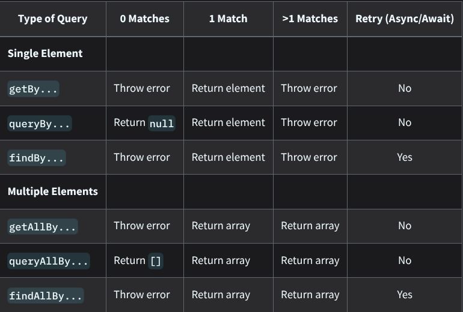

# Introduction to React Testing
- In this, we are gonna learn about Vitest and will switch to Vitest from Jest, since Vitest integrates nicely with vite.
- Then we will add more cabability using React Testing Library(RTL).

# UI Testing
- UI tests give us more confidence that our websites contain the intended contents and behave as we want, and notify us when something no longer satisfies our requirements. 

# Installing Vitest with RTL
- To install, follow the following guide/link
- https://www.robinwieruch.de/vitest-react-testing-library/
- and then install this package
- `npm install @testing-library/user-event --save-dev
`
- In every `.test.jsx` file, import the following thing
```
// Brings in core React features (optional in newer React, but needed for JSX parsing)
import React from 'react';

// Brings in Vitest testing functions like describe (suites), it (tests), and expect (assertions)
import { describe, it, expect } from 'vitest';

// Brings in React Testing Library functions to render components into a virtual DOM and query elements
import { render, screen } from '@testing-library/react';

// Extends Vitest's expect with custom DOM matchers like toBeInTheDocument()
import "@testing-library/jest-dom/vitest"; 

// Imports the actual React component you want to test
import Greeting from './Greeting.jsx';
```
- [CheetSheet](https://testing-library.com/docs/react-testing-library/cheatsheet)
- Above is the cheetsheet for testing

 # Queries
 - Queries are the methods that Testing Library gives you to find elements on the page. 
 - There are several types of queries ("get", "find", "query");
 - The difference between them is whether the query will throw an error if no element is found or if it will return a Promise and retry.
 - After selecting an element, you can use the Events API or user-event to fire events and simulate user interactions with the page, or use Jest and jest-dom to make assertions about the element.
  
## Types of Queries
- **1) Single Elements**
  - `getBy...`: 
    - Returns the matching node for a query, and throw a descriptive error if no elements match or if more than one match is found (use getAllBy instead if more than one element is expected).
  - `queryBy...`: 
    - Returns the matching node for a query, and return null if no elements match. This is useful for asserting an element that is not present. 
    - Throws an error if more than one match is found (use queryAllBy instead if this is OK).
  - `findBy...`: 
    - Returns a Promise which resolves when an element is found which matches the given query. 
    - The promise is rejected if no element is found or if more than one element is found after a default timeout of 1000ms. 
    - is used in React Testing Library when you are waiting for something to appear asynchronously on the screen (like data arriving from an API or a component appearing after a setTimeout).
    - If you need to find more than one element, use findAllBy
- **2) Multiple Elements**
    - `getAllBy...`: 
      - Returns an array of all matching nodes for a query, and throws an error if no elements match.
    - `queryAllBy...`: 
      - Returns an array of all matching nodes for a query, and return an empty array ([]) if no elements match.
    - `findAllBy...`: 
      - Returns a promise which resolves to an array of elements when any elements are found which match the given query. 
      - The promise is rejected if no elements are found after a default timeout of 1000ms.
- 

## Priorities
- your test should resemble how users interact with your code (component, page, etc.) as much as possible.
- **1) Queries Accessible to Everyone**
  - Queries that reflect the experience of visual/mouse users as well as those that use assistive technology.
  - **i. getByRole**
    -  This can be used to query every element that is exposed in the accessibility tree.
    -  With the name option you can filter the returned elements by their accessible name
    -  This should be your top preference for just about everything. 
    -  There's not much you can't get with this (if you can't, it's possible your UI is inaccessible). 
    -  Most often, this will be used with the name option like so: getByRole('button', {name: /submit/i})
   - **ii. getByLabelText**
     - This method is really good for form fields. When navigating through a website form, users find elements using label text. 
     - This method emulates that behavior, so it should be your top preference.
   - **iii. getByPlaceholderText**
     -  A placeholder is not a substitute for a label. 
     -  But if that's all you have, then it's better than alternatives.
  - **iv. getByText**: 
    - Outside of forms, text content is the main way users find elements. 
    - This method can be used to find non-interactive elements (like divs, spans, and paragraphs).
  - **v. getByDisplayValue**: 
    - The current value of a form element can be useful when navigating a page with filled-in values.
- **2) Semantic Queries**
  - HTML5 and ARIA compliant selectors. 
  - Note that the user experience of interacting with these attributes varies greatly across browsers and assistive technology.
  - **i. getByAltText**: 
    - If your element is one which supports alt text (img, area, input, and any custom element), then you can use this to find that element.
  - **ii. getByTitle**: 
    - The title attribute is not consistently read by screenreaders, and is not visible by default for sighted users
- **3) Test IDs**
  - **i. getByTestId**: 
    - The user cannot see (or hear) these, so this is only recommended for cases where you can't match by role or text or it doesn't make sense (e.g. the text is dynamic).
    - `A data-testid=""` is essentially a custom `id` attribute specifically reserved for testing, so your tests don't break if a designer changes the CSS class name or the button text later.