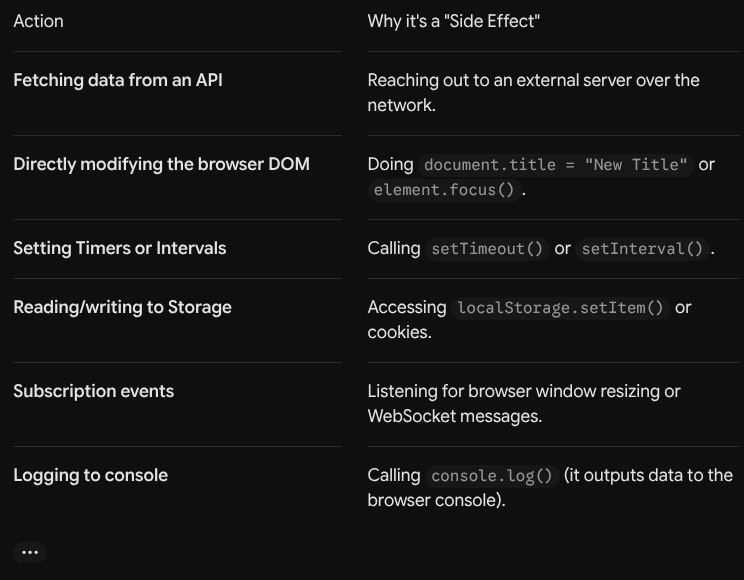

# Side Effects
- A Side Effect (or just "effect") is anything a component does that affects or interacts with the world outside of its own rendering calculation.
- Common Examples
- 
- React offers us `useEffect` to use such side effect

# The useEffect hook
- `useEffect` is a built-in React function (Hook) that lets your component safely perform side effects (interactions with the outside world) after rendering.
- Syntax
- 
    ``` 
    useEffect(()=>{
        //side effect will run if something changes
   
    },[])//here, [] is dependencies
    ```
- `useEffect` needs to depend on something to know whether to run side effect or not, and this is called dependences("[]")
## Dependencies
- By Default, `useEffect` runs on every re-render, but we can change it, the second parameter accepts an array of dependencies allowing hook to re-render only when re-render changes, we can also pass an empty dependencies
- If `useEffect` runs on every re-render it can cause performance issues
- So if you have a state variable and want to have some side-effect occur any time the state changes, you can use this hook and mention the state variable in the dependency array.
```
useEffect(() => {
  // This runs after every render
});

useEffect(() => {
  // This runs only on mount (when the component appears)
}, []);

useEffect(() => {
  // This runs on mount *and also* if either a or b have changed since the last render
}, [a, b]);
```
## The cleanup function
- It is used when the component is about to be removed from DOM(Screen)
- This prevents memory leaks cause the application to consume more memory over time leading to slow performance or even crashes.
- You can return a function from the callback in the `useEffect` hook, which will be executed each time before the next effect is run, and one final time when the component is unmounted

- Summary
```
useEffect(
  () => {
    // execute side effect
    return () => {
      // cleanup function on unmounting or re-running effect
    }
  },
  // optional dependency array
  [/* 0 or more entries */]
)
```